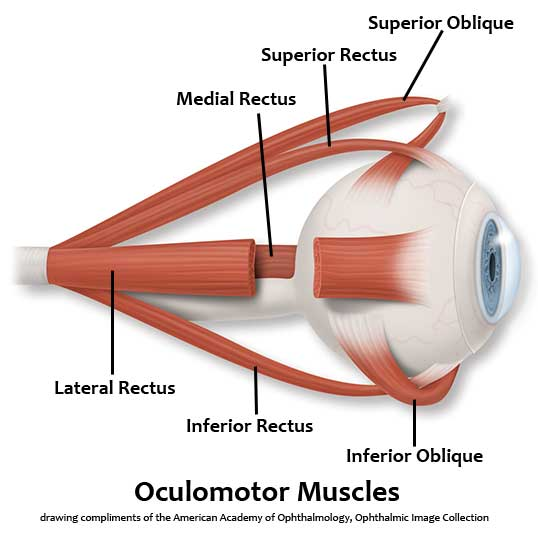

# Giải phẫu lác ứng dụng (tổng hợp từ 2 nguồn chính + script video)

> Nguồn: script video Cybersight (Fredrick: mổ lại, liệt III, treo lùi; Wagner: lác ngoài lớn) + video kinh điển EyeRounds (Kemp, Stiff, AAPOS) + tutorial EyeRounds (Binocular Vision — Bhola; nghiệm pháp che mắt — bài 40). Số đo chêm sao (*) là chuẩn sách giáo khoa, đối chiếu AAO BCSC khi cần chính xác tuyệt đối. Ảnh: EyeRounds (© University of Iowa, dùng cho học tập). Học xong phần này thì vào [Tổng quan nhóm S](https://github.com/drthe92/eye-surgeries/blob/main/tong-quan-S-lac.md).

## 1. Vòng xoắn Tillaux — 4 số phải thuộc

Khoảng cách bám cơ tới rìa (limbus), từ trong ra ngoài (*):

| Cơ | Khoảng cách | Ghi nhớ mổ |
|---|---|---|
| Trực trong (MR) | 5,5mm | Gần rìa nhất — lùi 5,5mm là về đúng bám cũ của bên kia trong lác trong bẩm sinh (bài 227: lùi 5,5 hai mắt) |
| Trực dưới (IR) | 6,5mm | Kề chéo dưới — mổ IR phải phân biệt IO (bài 251) |
| Trực ngoài (LR) | ~7mm | Mỏng củng mạc phía sau bám (xem mục 5) |
| Trực trên (SR) | 7,7mm | Xa rìa nhất — đừng nhầm với gân chéo trên khi tìm SO (bài 226) |

## 2. Chi phối thần kinh — bảng một dòng

- **III:** trực trong, trực trên, trực dưới, chéo dưới + nâng mi (sụp mi khi liệt III — bài 226).
- **IV:** chéo trên duy nhất — test xoay trong khi nhìn xuống để biết SO còn sống trước khi chuyển (bài 226).
- **VI:** trực ngoài duy nhất — liệt VI hoàn toàn thì chuyển trực trên + Foster (bài 252).

## 3. Mạch máu nuôi đoạn trước — quy tắc 2 cơ

- 7 động mạch thể mi trước: trực trên/trong/dưới mỗi cơ 2 nhánh, trực ngoài 1 nhánh; **cơ chéo không nuôi đoạn trước** (*).
- Từ script Fredrick (bài 227): mổ tối đa **2 cơ trực/mắt** — quá là thiếu máu đoạn trước; đốt mạch thể mi khi bộc lộ (chảy máu là mốc), nhưng giữ mạch khi chuyển cơ (bài 231).
- Tĩnh mạch xoắn (vortex): 4 tĩnh mạch sau xích đạo — mổ cơ sau (Faden, chuyển sau 15mm) đừng đâm vào.

## 4. Bao Tenon, ròng rọc và đường mở

- Bao Tenon bọc cơ — bóc đúng mặt phẳng mới thấy cơ sạch; khâu lẫn Tenon vào kết mạc gây nang vùi (bài 227).
- Ròng rọc (pulley) giữ hướng kéo cơ — chuyển cơ (VRT, Jensen) thực chất là đổi ròng rọc chứ không đổi cơ.
- Đường mở: cùng đồ cách rìa ~8mm (bài 238: kéo song song nẹp mi, đừng ra sau quá vào mi trên); rìa (limbal) bộc lộ rộng hơn nhưng sẹo hơn (bài 42 vs 43).

## 5. Độ dày củng mạc — quy tắc 30%

- Từ script Fredrick (bài 227): trước bám ~0,8mm → tại bám ~0,5mm → **sau bám chỉ ~0,3mm**. Khâu củng mạc sâu ~30%, nhìn đầu kim xám trong mô; **thà nông còn hơn sâu** (sâu là vào dịch kính).
- Vùng sau bám là điểm yếu vỡ khi chấn thương cùn — cũng là lý do móc trơn (Graefe) đi trước, móc khía (Green) đi sau.

## 6. Đỉnh ổ mắt và ròng rọc chéo trên

- Vòng Zinn: 4 trực xuất phát từ đỉnh — liệt nhiều cơ sau chấn thương đỉnh thì nghĩ hội chứng đỉnh ổ mắt, không phải lác đơn thuần.
- Ròng rọc chéo trên ở mũi-trên ổ mắt; gân chéo trên đi sau xích đạo phía thái dương (bài 226) — chuyển ra trước-ra mũi mũi thành cơ khép (bài 50, 226).

## 7. Ép buộc (forced duction) — khám bằng giải phẫu

- Kẹp rìa nhấc cầu lên rồi đẩy (đừng ấn xuống gây âm tính giả — bài 227): cản ở đâu là cơ đó co rút; lỏng ở đâu là cơ đó liệt.
- Ép buộc mắt lành trước làm chuẩn bình thường (bài 251) — không có chuẩn thì đừng kết luận.

*Sơ đồ cơ vận nhãn, EyeRounds (© University of Iowa). Đối chiếu vòng Tillaux mục 1 khi đọc.*

## Đọc tiếp

- EyeRounds: [Binocular Vision](https://eyerounds.org/tutorials/Bhola-BinocularVision.htm) (Bhola) — song thị và cơ chế nhìn đôi; video [nghiệm pháp che mắt](https://eyerounds.org/video/basic-cover-test.htm) (bài 40).
- Cybersight: transcript các bài 226, 227, 235, 238 trong thư viện (mục dọc cơ, mạch máu, khâu củng mạc).
