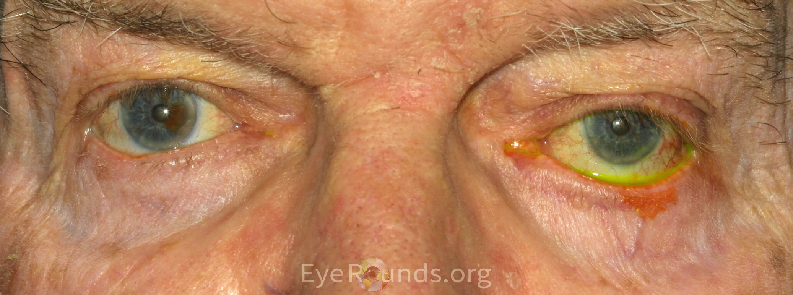
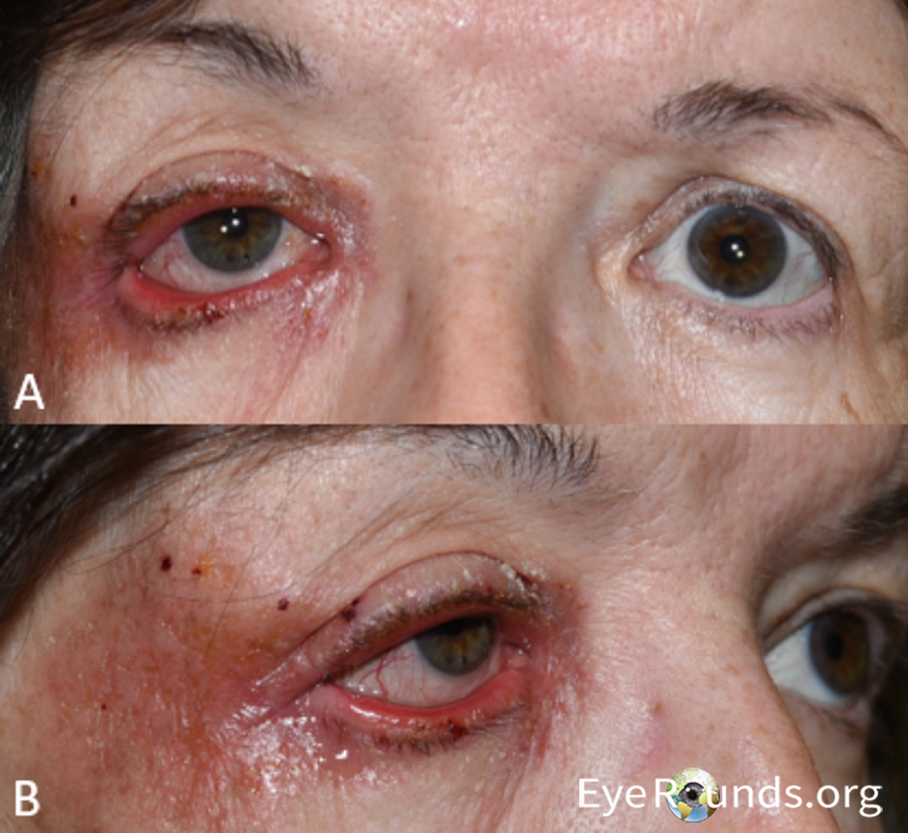
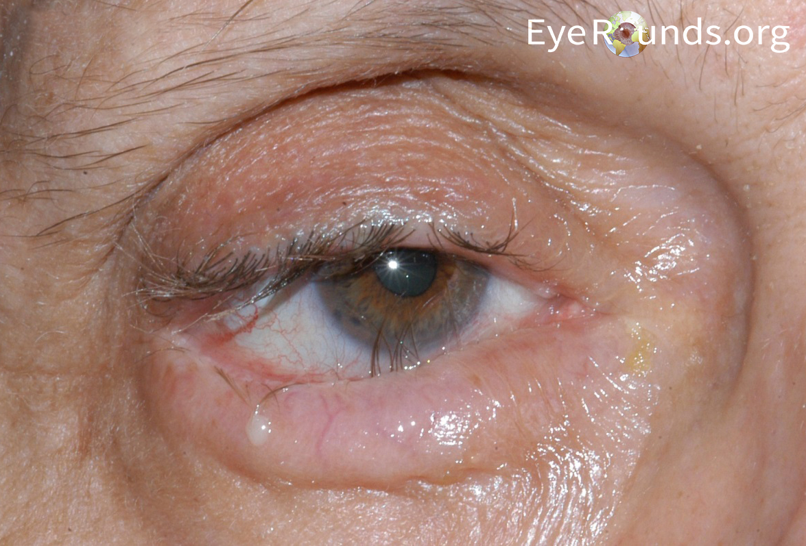
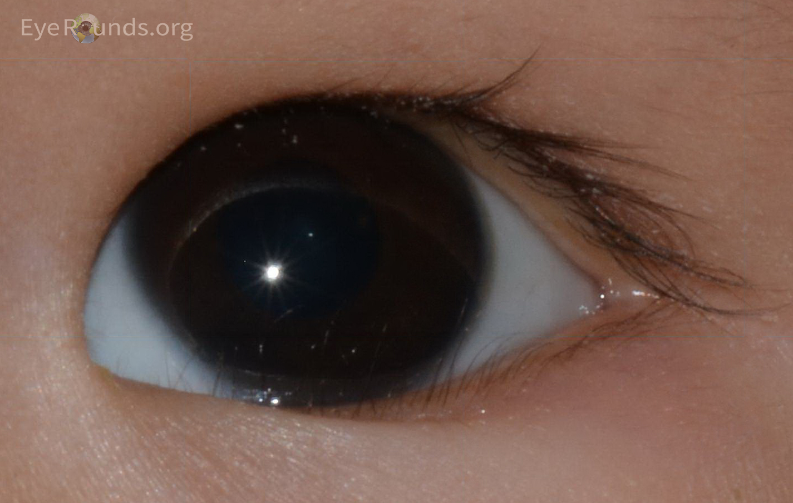
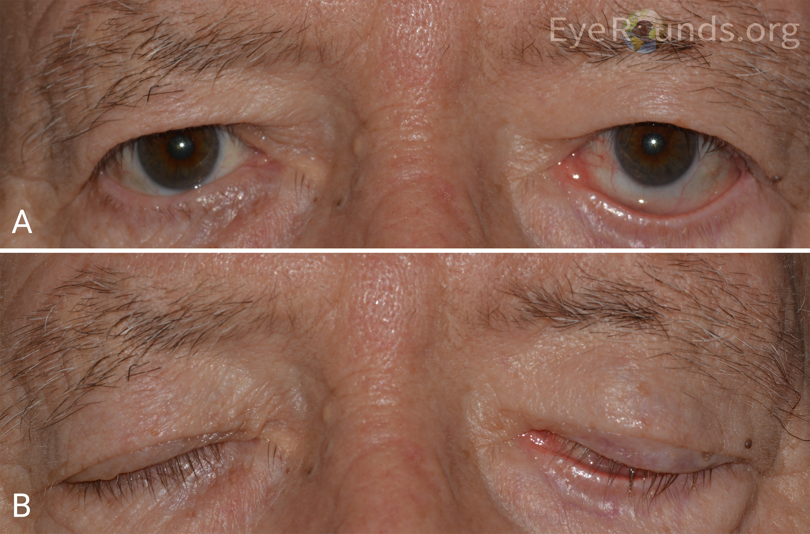

# Giải phẫu mi dưới ứng dụng (tổng hợp từ EyeRounds)

> Nguồn: tổng hợp từ tutorial **Lower Eyelid Malpositions** (Lee, Diel, Simmons, Allen, Pham, Carter, Shriver, EyeRounds 2024) — ảnh giữ nguyên từ EyeRounds, dùng cho học tập theo điều khoản cho phép sao chép vì mục đích giáo dục của University of Iowa. Học xong phần này thì vào [Tổng quan nhóm B](https://github.com/drthe92/eye-surgeries/blob/main/tong-quan-B-lat-quam-mi-duoi.md).

## 1. Hai lá mi (lamellae)

- **Lá trước (anterior lamella):** da + cơ vòng mi. Thừa/co kéo lá trước → quặm/lật do sẹo ngoài — xem bài lùi lá trước.
- **Lá sau (posterior lamella):** sụn mi (tarsus) + kết mạc. Co rút lá sau → quặm sẹo — xem bài bẻ sụn, ghép niêm mạc.
- **Lớp giữa (middle lamella):** vách ổ mắt + mỡ + cơ rút. Sẹo lớp giữa kéo mi xuống → co rút mi (xem nhóm co rút).

## 2. Gân góc mắt (canthal tendons)

- **Gân góc ngoài:** bám củ Whitnall, gồm chân trên và chân dưới (inferior crus). Giãn/chân dưới rời → lỏng ngang, lật mi — cắt chân dưới (cantholysis) để huy động, neo lại bằng dải sụn (bài 01).
- **Gân góc trong:** giữ điểm lệ áp hồ lệ. Lỏng trong → điểm lệ lệch — con thoi trong (bài 07).

## 3. Cơ rút mi dưới (retractors)

- Cân cơ bao mi dưới (capsulopalpebral fascia) + cơ sụn mi dưới, bám bờ dưới sụn. Tuột/bong → mi mất lực kéo xuống-trong → lật (kèm sâu cùng đồ, đường trắng white line, mi không theo khi nhìn xuống).
- Sửa bằng khâu lại vào bờ sụn (bài 08 đường kết mạc, bài 11 đường da).

## 4. Cơ vòng mi (orbicularis oculi)

- Ba phần: trước sụn (pretarsal), trước vách (preseptal), ổ mắt (orbital). Cơ chế quặm tuổi già: phần trước vách trượt lên đè phần trước sụn (overriding) khi cơ rút đã tuột.
- Liệt VII → mất trương lực cơ vòng → lật liệt + hở mi (xem nhóm F).

## 5. Điểm lệ và bơm lệ

- Điểm lệ dưới phải ngập hồ lệ mới dẫn lưu. Lật/lỏng làm điểm lệ lệch → chảy nước mắt dù lệ đạo thông — phải đưa điểm lệ về chỗ (bài 07) chứ không phải thông lệ.

## Hình minh họa lâm sàng (EyeRounds, © University of Iowa)

*Lật mi trong tuổi già: lỏng ngang + tuột cơ rút (bài 07–10).*

*Lật do thiếu da co kéo: viêm da do thuốc nhỏ mắt (bài 185).*

*Quặm tuổi già: bờ mi cuộn vào, cơ vòng đè (bài 11–12).*

*Epiblepharon: da đè lông, không sẹo kết mạc (bài 192, phân biệt bài 193).*

*Co rút + hở mi do liệt mặt (nhóm F, co rút mi).*

## Đọc tiếp trên EyeRounds

- [Lower Eyelid Malpositions — tutorial gốc](https://eyerounds.org/tutorials/lower-eyelid-malpositions/index.htm)
- [A Primer on Ptosis](https://eyerounds.org/tutorials/Ptosis/index.htm) (giải phẫu mi trên — đọc trước nhóm P)
- [Lateral Canthotomy and Cantholysis](https://eyerounds.org/tutorials/lateral-canthotomy-cantholysis.htm) (giải phẫu góc ngoài)
