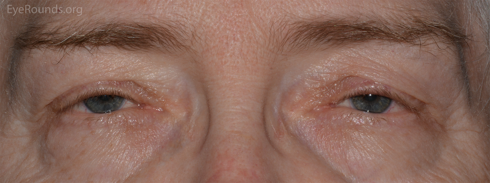
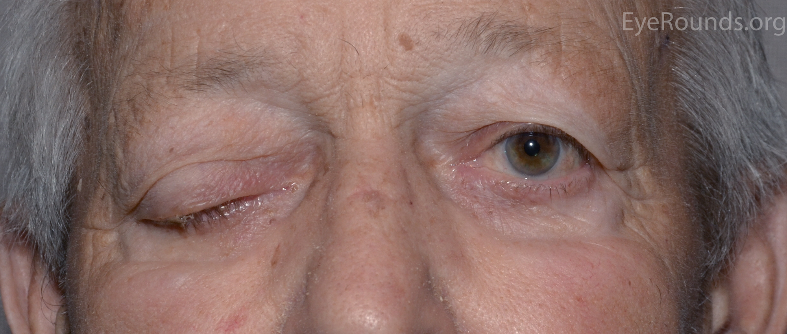
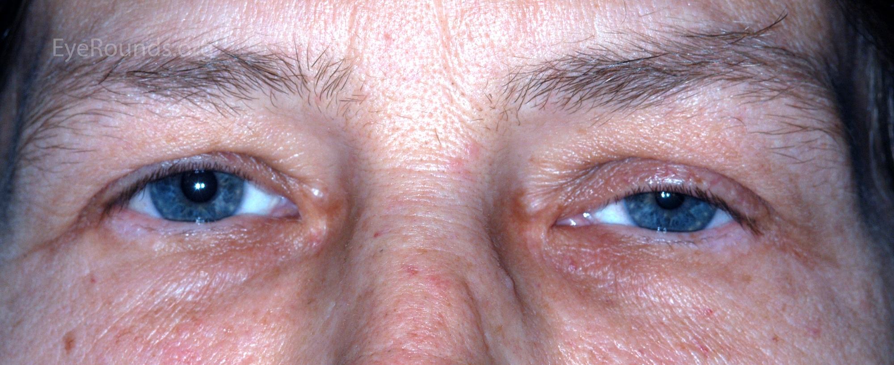
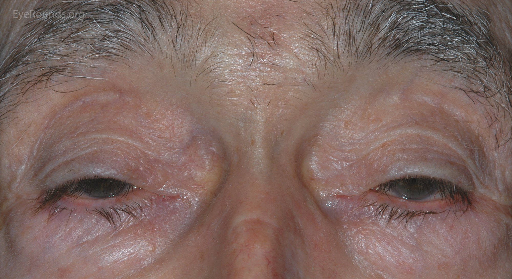
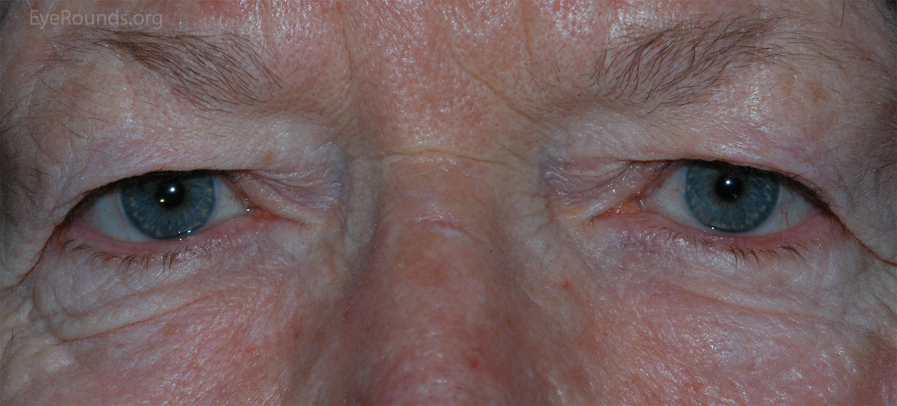
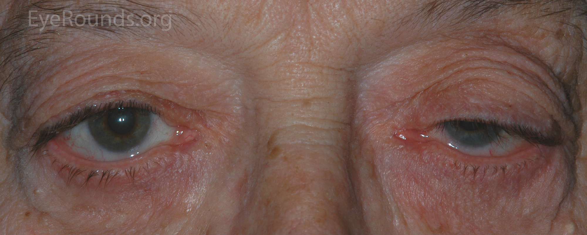
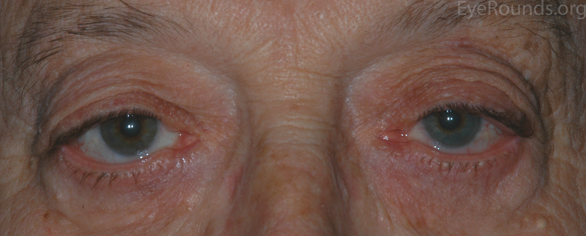
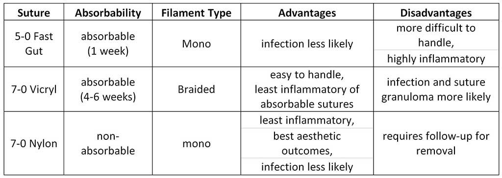
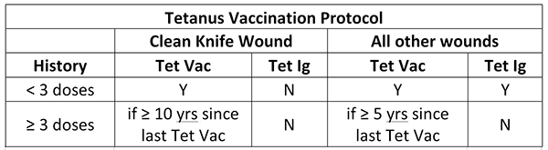

# Giải phẫu mi trên ứng dụng (tổng hợp từ 2 nguồn chính + video đã học)

> Nguồn: tutorial **A Primer on Ptosis** (EyeRounds) + script video Cybersight (liệt III — cơ nâng/Muller, Fredrick) + video mổ nhóm P trong thư viện (81–101, 256). Số đo chêm sao (*) là chuẩn sách giáo khoa, đối chiếu AAO BCSC khi cần chính xác tuyệt đối. Ảnh: EyeRounds (© University of Iowa, dùng cho học tập). Học xong phần này thì vào nhóm P.

## 1. Ba lá mi trên và sụn mi

- Da mỏng, cơ vòng mi (VII), vách; sụn mi trên **cao ~10mm ở giữa** (*), dài ~29mm, dày ~1mm — khung chịu mọi mũi khâu tiến cơ nâng.
- Mạch bờ mi cách bờ trên ~4mm mặt trước sụn; **mạch ngoại vi ngay trên bờ sụn** — tiến cơ nâng bóc quá cao là vào mạch này (chảy máu + bầm).
- Tuyến bờ mi (Meibomian) trong sụn: mốc cao độ khi treo góc (xem bài 03).

## 2. Cơ nâng mi (levator palpebrae)

- Xuất phát đỉnh ổ mắt, chạy ra trước ~40mm cơ + cân (*), tới dây chằng Whitnall (dây chằng ngang treo) thì chia hai lá:
  - **Lá trước (cân):** vào da tạo **nếp mi** + vào bờ trên sụn — đứt/dãn lá này là sụp mi tuổi già (aponeurotic).
  - **Lá sau:** chính là **cơ Muller** (xem mục 3).
- Sừng trong yếu hơn sừng ngoài → sụp hay lệch trong trước.
- Bài mổ: tiến/cắt ngắn cân đường trước (81 Allen, 256 Caesar); bóc tới cân Whitnall là mốc "đủ sâu".

## 3. Cơ Muller (cơ sụn-mi trên)

- Cơ trơn giao cảm, từ mặt dưới cơ nâng tới bờ trên sụn — nâng thêm ~2mm.
- Test phenylephrine (+): sụp do Muller còn tốt → cắt cơ Muller-kết mạc MMCR (84/85) thay vì cắt cơ nâng; test (−) → phải tiến cơ nâng.
- Từ script liệt III (226): sụp do III là liệt cơ nâng thật; sụp do Horner là liệt Muller (nhẹ 2mm + đồng tử nhỏ) — phân biệt bằng đồng tử.

*Sụp mi hai mắt — đo MRD1 và chức năng cơ nâng trước mọi quyết định (tutorial Ptosis, EyeRounds).*

*Liệt III: sụp hoàn toàn + lác ngoài (bài 226) — khác sụp cơ nâng đơn thuần.*

*Horner: sụp nhẹ + đồng tử nhỏ cùng bên — liệt Muller, đừng mổ cơ nâng.*

## 4. Vách, mỡ và tuyến lệ

- Mi trên có **2 túi mỡ: trong và giữa-trước cân**; **tuyến lệ nằm ngoài-thái dương trên** — cắt mỡ túi ngoài quá tay là vào tuyến lệ gây khô mắt (nhóm E).
- Vách bám thấp ở người châu Á + mỡ sa thấp + không có/sụp nếp mi thấp → mắt một mí: tạo hình mi châu Á (bài 74) là tái tạo lại 3 điểm này.

## 5. Mạch máu-thần kinh cần tránh

- Động mạch trên ổ mắt/ròng rọc (V1) ở mũi-trên — rạch trong quá cao gây chảy máu và tê trán.
- Nhánh VII thái dương-gò má nuôi cơ vòng — liệt sau mổ vùng thái dương (bài 20, nhóm W).
- Mạch ngoại vi trên bờ sụn (mục 1) — thủ phạm bầm sau tiến cơ nâng.

## 6. Nếp mi (lid crease)

- Nếp mi = chỗ sợi cân cơ nâng bám vào da, người Âu cao ~7–10mm trên bờ (*); châu Á thấp/vắng → mắt một mí.
- Nâng/hạ nếp mi (bài 75) thực chất là dời điểm bám da của cân — hiểu nếp mi thì mọi tạo hình mi trên đều dễ.

## 7. Bốn số đo trước mọi ca sụp mi

| Số đo | Cách đo | Ngưỡng quyết định (*) |
|---|---|---|
| MRD1 | Phản xạ giác mạc–bờ mi trên | Bình thường 4–5mm; <2mm là sụp rõ |
| Chức năng cơ nâng | Biên độ nâng (giữ mày) | Tốt >10mm (tiến cơ nâng); 4–7 trung bình; <4 kém → treo trán |
| Bell | Nhắm ép nhìn lên | Kém + hở mi sau mổ = trợt giác mạc |
| Phenylephrine test | Nhỏ 10%, đo lại sau 5–10 phút | (+) → MMCR; (−) → tiến cơ nâng/treo trán |

*Sụp tuổi già do dãn cân — chỉ định tiến cơ nâng (81, 256).*

*Giả sụp do da thừa (dermatochalasis) — cắt da là đủ, đừng tiến cơ nâng.*

*Trước và sau sửa sụp mi (tutorial Ptosis, EyeRounds).*

## 8. Cơ chế sụp mi theo nguyên nhân (đọc để chọn mổ)

- **Cân (tuổi già)** — hay gặp nhất: tiến/cắt ngắn đường trước (81, 256).
- **Cơ (bẩm sinh nặng, nhược cơ)** — chức năng kém: treo trán (91–96).
- **Thần kinh (III, Horner)** — chữa nguyên nhân; III mạn liệt hoàn toàn thì treo trán + lác (226).
- **Cơ học (u, da thừa)** — cắt u/da, đừng động cơ nâng.
- **Giả sụp** — sa mày, đối bên co rút, Hering (nâng một bên lộ sụp bên kia): khám hai mắt trước khi mổ.

## 9. Vùng rách mi trên (đọc trước nhóm T)

*Bảng phân vùng và xử trí rách mi (tutorial Eyelid Lacerations, EyeRounds) — rách toàn lớp qua bờ mi khâu như wedge (bài 135).*

## Đọc tiếp

- [A Primer on Ptosis — tutorial gốc](https://eyerounds.org/tutorials/Ptosis/index.htm)
- [Emergent Evaluation of Eyelid Lacerations](https://eyerounds.org/tutorials/Eyelid-lacerations/index.htm)
- Bài 81/256 (tiến cơ nâng), 84/85 (MMCR), 91–96 (treo trán) trong thư viện.
